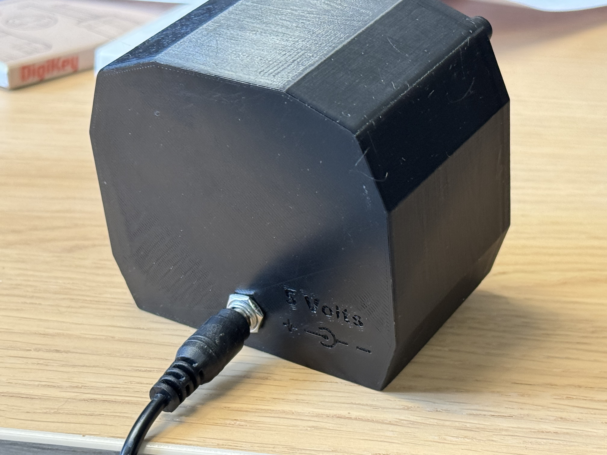
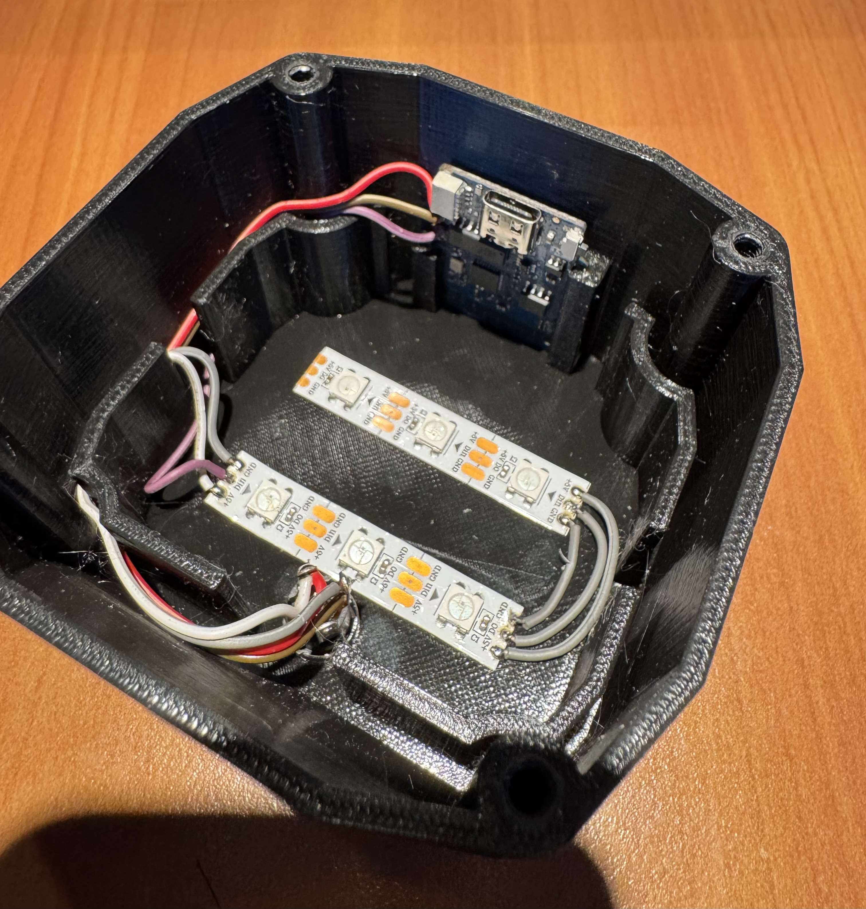

# AZBA Status Indicator

A 3D-printable WiFi-connected LED indicator display for real-time monitoring of AZBA (Airspace Restriction Zone) activation status. This project displays the current and upcoming airspace restrictions for a configurable zone using an ESP8266 microcontroller and addressable RGB LEDs.

**Hardware Model:** [AZBA Status Indicator on Printables](https://www.printables.com/model/1487021-azba-status-indicator-3d-printable-display-for-des)

<div align="center">





</div>

## Features

- 🟢 **Real-time AZBA Status Display** — Shows if your configured airspace zone is currently active
- 🟡 **Upcoming Activity Alerts** — Visual indication if the zone will be active within 4 hours
- 🔴 **LED Status Indicators**
  - Blue: WiFi connecting
  - White: Error or startup
  - Red (blinking): Zone active now
  - Orange (blinking): Zone will be active soon (within 4 hours)
  - Yellow (solid): Zone will be active later
  - Green (solid): Zone inactive
- 🔄 **Automatic Refresh** — Fetches AZBA data every 5 minutes
- 🔁 **Auto-Reboot** — Automatically reboots every 48 hours to prevent memory drift
- 🛡️ **WiFi Resilience** — Automatic retry logic (3 retries with 25-second intervals)
- 🌐 **Static or DHCP IP** — Flexible network configuration

## Hardware Requirements

- **Microcontroller:** Wemos D1 Mini Lite (ESP8266)
- **LEDs:** 6× WS2812B (NeoPixel) addressable RGB LEDs
- **Power Supply:** 5V microUSB (for Wemos) + 5V dedicated (for LEDs if needed)
- **3D Enclosure:** See [Printables model](https://www.printables.com/model/1487021-azba-status-indicator-3d-printable-display-for-des)

## Software Requirements

- **PlatformIO** (recommended) or Arduino IDE
- **Python 3** (for generating secrets from environment variables)
- **Dependencies** (auto-installed by PlatformIO):
  - Adafruit NeoPixel library
  - ArduinoJson library

## Quick Start

### 1. Clone the Repository

```bash
git clone https://github.com/YOUR_USERNAME/AZBA-Indicator.git
cd AZBA-Indicator
```

### 2. Configure Your Secrets

Copy the example secrets file:

```bash
cp src/secrets.example.h src/secrets.h
```

Edit `src/secrets.h` with your WiFi credentials:

```c
const char* ssid     = "Your-WiFi-SSID";
const char* password = "Your-WiFi-Password";
```

**Or** use environment variables for automated generation:

```bash
export SSID="Your-WiFi-SSID"
export PASSWORD="Your-WiFi-Password"
```

### 3. Configure Your AZBA Zone

Edit `src/main.cpp` and change the `ZONE_ID` to your desired zone:

```cpp
const char* ZONE_ID  = "R45N4";   // Change to your zone (e.g., R45S3, R142A)
```

Available zones: R45S3, R142A, R45N5.1, R45N4, etc. (see AZBA documentation)

### 4. Build and Upload

```bash
platformio run
platformio run --target upload
```

Or use the pre-configured tasks in VS Code if you have PlatformIO extension installed.

### 5. Monitor Serial Output

```bash
platformio device monitor --baud 115200
```

## Advanced Configuration

### Static IP (Optional)

If you want to use a static IP instead of DHCP, set environment variables before building:

```bash
export SSID="Your-WiFi-SSID"
export PASSWORD="Your-WiFi-Password"
export USE_STATIC_IP=true
export STATIC_IP="192.168.1.50"
export GATEWAY_IP="192.168.1.1"
export SUBNET_MASK="255.255.255.0"
export DNS1_IP="8.8.8.8"
export DNS2_IP="8.8.4.4"
platformio run
```

Then uncomment `#define USE_STATIC_IP` in `src/secrets.h` if not auto-generated.

### Configurable Parameters

Edit the constants in `src/main.cpp`:

- `FETCH_INTERVAL_MS` — Refresh interval (default: 300,000 ms = 5 minutes)
- `REBOOT_INTERVAL_MS` — Auto-reboot interval (default: 172,800,000 ms = 48 hours)
- `FETCH_MAX_RETRIES` — Number of retries on failure (default: 3)
- `FETCH_RETRY_INTERVAL_MS` — Delay between retries (default: 25 seconds)
- `LED_PIN` — GPIO pin for LED strip (default: D4)
- `LED_COUNT` — Number of LEDs (default: 6)

## LED Behavior

### Status Modes

| Mode | LED Color | Behavior | Meaning |
|------|-----------|----------|---------|
| `MODE_CONNECTING` | Blue | Solid | WiFi is connecting |
| `MODE_ERROR_OR_STARTUP` | White | Solid | Startup or error condition |
| `MODE_ACTIVE_NOW` | Red | Blinking | Zone is active right now |
| `MODE_WILL_BE_ACTIVE_SOON` | Orange | Blinking | Zone will be active within 4 hours |
| `MODE_WILL_BE_ACTIVE_LATER` | Yellow | Solid | Zone will be active, but beyond 4 hours |
| `MODE_INACTIVE` | Green | Solid | Zone is inactive |

## API Data Source

The device fetches AZBA data from:

```
http://www.sia.aviation-civile.gouv.fr/schedules
```

Parsed via the local PHP backend (`php/azba.php`), which you can host on your own server or public endpoint.

## Project Structure

```
.
├── README.md                      # This file
├── platformio.ini                 # PlatformIO configuration
├── src/
│   ├── main.cpp                   # Main firmware code
│   ├── secrets.example.h          # Template for WiFi credentials & IP config
│   └── secrets.h                  # ⚠️ Local credentials (NOT committed, git-ignored)
├── extra/
│   └── generate_secrets.py        # Script to auto-generate secrets.h from env vars
├── php/
│   └── azba.php                   # PHP backend to parse and serve AZBA data (optional)
├── cad/
│   ├── fusion360/                 # 3D CAD files (Fusion 360 project)
│   ├── step/                      # STEP format 3D models
│   └── images/                    # Product photos and 3D renderings
└── .gitignore                     # Git ignore rules (includes secrets, build artifacts)
```

## Building the 3D Enclosure

The 3D printable enclosure is available on Printables:
[AZBA Status Indicator Model](https://www.printables.com/model/1487021-azba-status-indicator-3d-printable-display-for-des)

**Recommended Settings:**
- **Material:** PLA or PETG
- **Layer Height:** 0.2 mm
- **Infill:** 15–20%
- **Support:** Yes (for LED window)
- **Print Time:** ~4–6 hours
- **Filament:** ~40–50 grams

## Troubleshooting

### Device won't connect to WiFi

1. Check credentials in `src/secrets.h`
2. Verify SSID is not hidden
3. Ensure WiFi signal is strong
4. Check serial output for error messages: `platformio device monitor --baud 115200`

### LEDs not lighting up

1. Verify LED_PIN configuration matches your wiring (default: D4)
2. Check power supply (5V, adequate amperage for all LEDs)
3. Verify WS2812B LED strip is properly connected (GND, 5V, Data)
4. Try uploading LED test sketch to verify wiring

### AZBA data not updating

1. Check internet connection: Open serial monitor and look for HTTP errors
2. Verify `ZONE_ID` is valid
3. Ensure backend URL (`URL_BASE`) is accessible
4. Check if SIA website structure has changed (might require `php/azba.php` update)

### Device reboots frequently

1. Check power supply stability (use good quality PSU)
2. Verify antenna position on Wemos D1 Mini (avoid metal surfaces)
3. Increase `REBOOT_INTERVAL_MS` if reboots are too frequent

## Contributing

Contributions are welcome! Please:

1. Fork the repository
2. Create a feature branch (`git checkout -b feature/your-feature`)
3. Make your changes
4. Test thoroughly on hardware
5. Commit with clear messages
6. Push to your fork
7. Open a Pull Request

## License

This project is licensed under the MIT License — see LICENSE file for details.

## Support & Feedback

- **Issues:** [GitHub Issues](https://github.com/YOUR_USERNAME/AZBA-Indicator/issues)
- **Printables Model Comments:** [Printables Discussion](https://www.printables.com/model/1487021-azba-status-indicator-3d-printable-display-for-des)

## Acknowledgments

- [Adafruit NeoPixel Library](https://github.com/adafruit/Adafruit_NeoPixel)
- [ArduinoJson Library](https://github.com/bblanchon/ArduinoJson)
- [PlatformIO](https://platformio.org/)
- SIA (Service de l'Information Aéronautique) for AZBA data
- Printables community for hardware feedback

---

**Last Updated:** November 2025
git init
