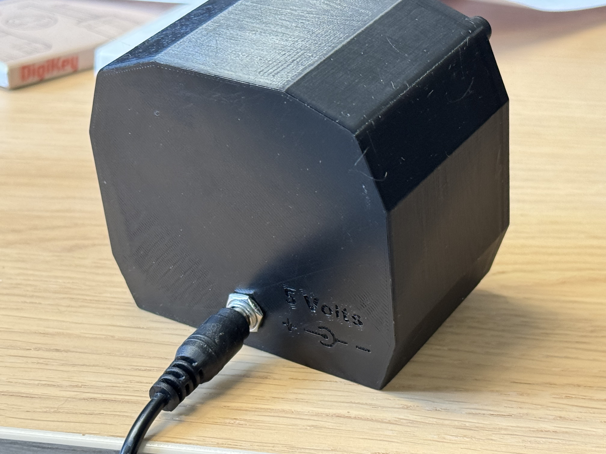
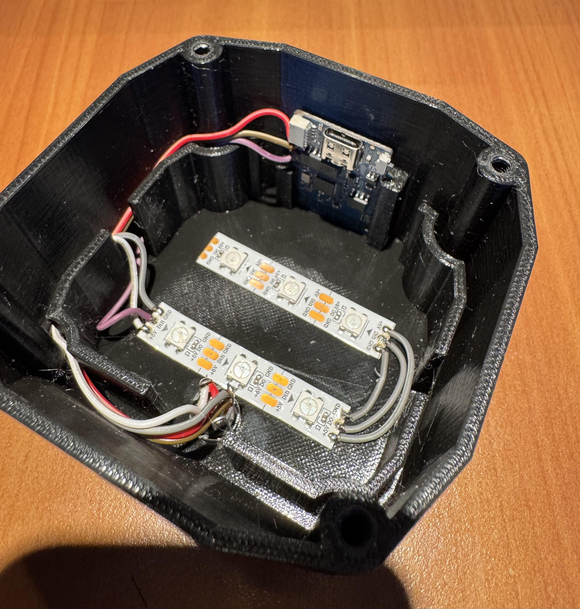

# AZBA Status Indicator

A 3D-printable WiFi-connected LED indicator display for real-time monitoring of AZBA (Airspace Restriction Zone) activation status. This project displays the current and upcoming airspace restrictions for a configurable zone using an ESP8266 microcontroller and addressable RGB LEDs.

**Hardware Model:** [AZBA Status Indicator on Printables](https://www.printables.com/model/1487021-azba-status-indicator-3d-printable-display-for-des)

<div align="center">





</div>

## Features

- **Real-time AZBA Status Display** — Shows if your configured airspace zone is currently active
- **Upcoming Activity Alerts** — Visual indication if the zone will be active within 4 hours
- **LED Status Indicators**
  - 🟢 Green (solid): Zone inactive and not planned to be active
  - 🟡 Yellow (solid): Zone will be active in the future
  - 🟠 Orange (blinking): Zone will be active soon (within 4 hours)
  - 🔴 Red (blinking): Zone active now
  - 🔵 Blue: WiFi connecting
  - ⚪ White: Error or startup
- 🔄 **Automatic Refresh** — Fetches AZBA data every 5 minutes
- 🔁 **Auto-Reboot** — Automatically reboots every 48 hours to prevent memory drift
- 🛡️ **WiFi Resilience** — Automatic retry logic (3 retries with 25-second intervals)
- 🌐 **Static or DHCP IP** — Flexible network configuration

## Hardware Requirements

- **Microcontroller:** Wemos D1 Mini Lite (ESP8266)
- **LEDs:** 6× WS2812B (NeoPixel) addressable RGB LEDs
- **Power Supply:** 5V/1A jack
- **3D Enclosure:** See [Printables model](https://www.printables.com/model/1487021-azba-status-indicator-3d-printable-display-for-des)

## Software Requirements

- **PlatformIO** (recommended) or Arduino IDE
- **Python 3** (optional - for generating secrets from environment variables)
- **PHP 8.0+** with cURL (for the `php/azba.php` backend and its tests; no Composer needed)
- **Dependencies** (auto-installed by PlatformIO):
  - Adafruit NeoPixel library
  - ArduinoJson library

## Quick Start

### 1. Clone the Repository

```bash
git clone https://github.com/stephanfo/AZBA-Indicator.git
cd AZBA-Indicator
```

### 2. Configure Your Secrets

Copy the example secrets file:

```bash
cp src/secrets.example.h src/secrets.h
```

Edit `src/secrets.h` with your WiFi credentials:

```c
const char* ssid     = "Your-WiFi-SSID";
const char* password = "Your-WiFi-Password";
```

**Or** use environment variables for automated generation:

```bash
export SSID="Your-WiFi-SSID"
export PASSWORD="Your-WiFi-Password"
```

### 3. Configure Your AZBA Zone

Edit `src/main.cpp` and change the `ZONE_ID` to your desired zone:

```cpp
const char* ZONE_ID  = "R149E";   // Change to your zone (e.g., R45S3, R142A)
```

Available zones: R45S3, R142A, R45N5.1, R45N4, etc. (see AZBA documentation)

### 4. Build and Upload

```bash
platformio run
platformio run --target upload
```

Or use the pre-configured tasks in VS Code if you have PlatformIO extension installed.

### 5. Monitor Serial Output

```bash
platformio device monitor --baud 115200
```

## Advanced Configuration

### Static IP (Optional)

If you want to use a static IP instead of DHCP, set environment variables before building:

```bash
export SSID="Your-WiFi-SSID"
export PASSWORD="Your-WiFi-Password"
export USE_STATIC_IP=true
export STATIC_IP="192.168.1.50"
export GATEWAY_IP="192.168.1.1"
export SUBNET_MASK="255.255.255.0"
export DNS1_IP="8.8.8.8"
export DNS2_IP="8.8.4.4"
platformio run
```

Then uncomment `#define USE_STATIC_IP` in `src/secrets.h` if not auto-generated.

### Configurable Parameters

Edit the constants in `src/main.cpp`:

- `FETCH_INTERVAL_MS` — Refresh interval (default: 300,000 ms = 5 minutes)
- `REBOOT_INTERVAL_MS` — Auto-reboot interval (default: 172,800,000 ms = 48 hours)
- `FETCH_MAX_RETRIES` — Number of retries on failure (default: 3)
- `FETCH_RETRY_INTERVAL_MS` — Delay between retries (default: 25 seconds)
- `LED_PIN` — GPIO pin for LED strip (default: D4)
- `LED_COUNT` — Number of LEDs (default: 6)

## LED Behavior

### Status Modes

| Mode | LED Color | Behavior | Meaning |
|------|-----------|----------|---------|
| `MODE_INACTIVE` | Green | Solid | Zone is inactive |
| `MODE_WILL_BE_ACTIVE_LATER` | Yellow | Solid | Zone will be active, but beyond 4 hours |
| `MODE_WILL_BE_ACTIVE_SOON` | Orange | Blinking | Zone will be active within 4 hours |
| `MODE_ACTIVE_NOW` | Red | Blinking | Zone is active right now |
| `MODE_CONNECTING` | Blue | Solid | WiFi is connecting |
| `MODE_ERROR_OR_STARTUP` | White | Solid | Startup or error condition |

## API Data Source

The device does **not** talk to the SIA directly. It calls a small PHP backend
(`php/azba.php`) that you host on your own server or public endpoint; the
firmware fetches `azba.php?azba=<ZONE_ID>` and reads three booleans per zone
(`is_active_now`, `will_be_active`, `will_be_active_soon`).

The backend is split into two files along a clean reuse boundary:

- **`php/azba_lib.php`** — a self-contained, reusable SIA client. It queries the
  **official SIA JSON API** (the same backend the "AZBA2" web app at
  `https://www.sia.aviation-civile.gouv.fr/azbaEx/` uses), decodes it, and
  validates it (fail-safe guards). It returns the **raw extracted data only** —
  the validity interval and each zone's activation time slots:
  - `…/api/v3/custom/currentDate` — the current validity window
  - `…/api/v3/r_t_b_as?…` — the list of active zones with their UTC time slots
- **`php/azba.php`** — the project-specific request handler. It holds this
  product's application logic: the activity flags (`is_active_now` /
  `will_be_active` / `will_be_active_soon`, with the +5 min anticipation and the
  4-hour window), the `?azba=<ZONE_ID>` filter, the metadata counters, and the
  JSON output contract the firmware expects.

> Historically `azba.php` scraped the HTML of `/schedules`. That page is now a
> JavaScript single-page app with no parseable text, so the scraper broke. The
> backend was rewritten to use the structured JSON API above, which is far more
> robust to wording/markup changes. See [CHANGELOG.md](CHANGELOG.md).

### Reusing the library in another project

`php/azba_lib.php` has no dependencies (no Composer). Copy it in, `require` it,
and call `azba_fetch()` to get the raw SIA data; then apply whatever analysis and
output format your project needs. You only write your own handler — never the
SIA querying/extraction.

```php
require 'azba_lib.php';

try {
    $sia = azba_fetch();
    // $sia = [
    //   'interval' => ['start_utc' => '...Z', 'end_utc' => '...Z'],
    //   'zones'    => [ 'R45S3' => ['activations' => [
    //       ['date' => 'YYYY-MM-DD', 'start_utc' => '...Z', 'end_utc' => '...Z'], ...
    //   ]], ... ],   // only zones active in the current window are present
    // ];

    // ...your project's logic: decide what "active/soon" means, format, etc.
    echo json_encode($sia);
} catch (AzbaFetchException $e) {  // SIA unreachable / auth rejected (HTTP code in getCode())
    // handle network failure
} catch (AzbaDataException $e) {   // SIA responded but the data can't be trusted
    // handle contract change — fail visibly, never assume "inactive"
}
```

See `php/azba.php` for a complete handler that turns this raw data into the
firmware's activity flags + JSON. Its `azba_compute_flags()` / `azba_filter_zone()`
/ `azba_build_metadata()` are examples of the per-project layer you would adapt.

To override the API base or shared secret (e.g. after a SIA rotation) without
editing the file, `define('AZBA_API_BASE', …)` / `define('AZBA_SHARE_SECRET', …)`
before the `require`, or pass `apiBase` / `shareSecret` in the `azba_fetch()`
options array.

### Fail-safe design (important)

A *false "inactive"* is dangerous — it could imply a restricted low-altitude
military zone is clear when it is actually active. So `azba.php` **never returns
a "200 OK" it is not confident in**: on any doubt (auth rejected, unexpected
response shape, stale validity window, unparsable times) it returns an HTTP
error, which the firmware shows as the **white ERROR LED** (a visible fault)
rather than silently signalling "clear" (green).

### Backend maintenance & tests

The data-integrity guards and the time logic are unit-tested. From the repo root:

```bash
php tests/run.php              # offline, deterministic unit tests
AZBA_LIVE=1 php tests/run.php  # also checks the live SIA API contract
```

If the SIA rotates its API again, the live test fails fast and the header of
`php/azba_lib.php` documents how to re-extract the API base / shared secret from
the web app bundle.

## Project Structure

```
.
├── README.md                      # This file
├── CHANGELOG.md                   # Notable changes per version
├── platformio.ini                 # PlatformIO configuration
├── src/
│   ├── main.cpp                   # Main firmware code
│   ├── secrets.example.h          # Template for WiFi credentials & IP config
│   └── secrets.h                  # ⚠️ Local credentials (NOT committed, git-ignored)
├── extra/
│   └── generate_secrets.py        # Script to auto-generate secrets.h from env vars
├── php/
│   ├── azba.php                   # Example request handler (reads ?azba=, outputs JSON)
│   └── azba_lib.php               # Self-contained, reusable SIA client (azba_fetch)
├── tests/
│   ├── run.php                    # Zero-dependency test runner (php tests/run.php)
│   └── fixtures/                  # Captured SIA API responses for offline tests
├── cad/
│   ├── fusion360/                 # 3D CAD files (Fusion 360 project)
│   ├── step/                      # STEP format 3D models
│   └── images/                    # Product photos and 3D renderings
└── .gitignore                     # Git ignore rules (includes secrets, build artifacts)
```

## Building the 3D Enclosure

The 3D printable enclosure is available on Printables:
[AZBA Status Indicator Model](https://www.printables.com/model/1487021-azba-status-indicator-3d-printable-display-for-des)

**Recommended Settings:**
- **Material:** PLA or PETG
- **Layer Height:** 0.2 mm
- **Infill:** 15–20%
- **Support:** Yes (for LED window)
- **Print Time:** ~4–6 hours
- **Filament:** ~40–50 grams

## Troubleshooting

### Device won't connect to WiFi

1. Check credentials in `src/secrets.h`
2. Verify SSID is not hidden
3. Ensure WiFi signal is strong and 2.4GHz available
4. Check serial output for error messages: `platformio device monitor --baud 115200`

### LEDs not lighting up

1. Verify LED_PIN configuration matches your wiring (default: D4)
2. Check power supply (5V, adequate amperage for all LEDs)
3. Verify WS2812B LED strip is properly connected (GND, 5V, Data)
4. Try uploading LED test sketch to verify wiring

### AZBA data not updating

1. Check internet connection: Open serial monitor and look for HTTP errors
2. Verify `ZONE_ID` is valid
3. Ensure backend URL (`URL_BASE`) is accessible
4. If the LED is **white (error)**, the backend returned a non-200 — this is the
   intended fail-safe (never a false "inactive"). Hit `azba.php` directly in a
   browser to read the JSON `error` message.
5. Run `AZBA_LIVE=1 php tests/run.php` on the server: if the live test fails, the
   SIA API contract changed and `php/azba.php` needs updating (the file header
   documents how to re-extract the API base / shared secret).

### Device reboots frequently

1. Check power supply stability (use good quality PSU)
2. Verify antenna position on Wemos D1 Mini (avoid metal surfaces around)
3. Increase `REBOOT_INTERVAL_MS` if reboots are too frequent

## Contributing

Contributions are welcome! Please:

1. Fork the repository
2. Create a feature branch (`git checkout -b feature/your-feature`)
3. Make your changes
4. Test thoroughly on hardware
5. Commit with clear messages
6. Push to your fork
7. Open a Pull Request

## License

This project is licensed under the MIT License — see LICENSE file for details.

## Support & Feedback

- **Issues:** [GitHub Issues](https://github.com/stephanfo/AZBA-Indicator/issues)
- **Printables Model Comments:** [Printables Discussion](https://www.printables.com/model/1487021-azba-status-indicator-3d-printable-display-for-des)

## Acknowledgments

- [Adafruit NeoPixel Library](https://github.com/adafruit/Adafruit_NeoPixel)
- [ArduinoJson Library](https://github.com/bblanchon/ArduinoJson)
- [PlatformIO](https://platformio.org/)
- SIA (Service de l'Information Aéronautique) for AZBA data
- Printables community for hardware feedback
